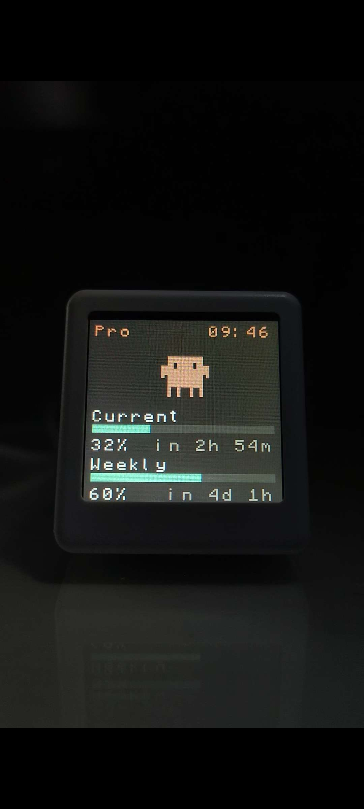

# MiniUsage — Claude Code Usage Monitor บนจอ 1.54" ST7789

จอแสดง usage ของ Claude Code subscription แบบ real-time
บนฮาร์ดแวร์ ESP8266 (ESP-12F) + ST7789 1.54" 240×240 IPS



---

## ภาพรวม

ระบบประกอบด้วย 3 ส่วน:

```
┌─────────────────┐   HTTP    ┌──────────────┐   API     ┌─────────────┐
│  ESP8266 +      │ ────────> │ Rust proxy   │ ────────> │ Anthropic   │
│  ST7789 LCD     │ poll /usage│ (Windows PC) │           │ API         │
│  (WiFi)         │   60s      │ port 8765    │           │             │
└─────────────────┘            └──────────────┘           └─────────────┘
        ▲
        │ SNTP (pool.ntp.org)
        └── นาฬิกามุมขวาบน
```

- **ESP8266 firmware**: NonOS SDK v3, bit-bang SPI → ST7789, ดึงข้อมูลจาก proxy
- **Rust proxy**: รันบนคอม Windows อ่าน OAuth token ของ Claude Code แล้วยิง Anthropic API
- **Simulator (optional)**: HTML preview สำหรับลองดีไซน์ UI ก่อน flash

---

## ฮาร์ดแวร์

### บอร์ดที่ใช้
- **SmallTV Ultra** (จาก GeekMagic) — ESP-12F + ST7789 240×240 ในตัวเดียว
- **CH340G USB-to-Serial** สำหรับ flash firmware


### CH340 PCB (แกะมาเอง)
ผมแกะ CH340 PCB ที่ซื้อมาเพื่อต่อสาย flash โดยตรงกับ SmallTV Ultra


### Pin mapping ของ SmallTV Ultra

| Function | GPIO | หมายเหตุ |
|----------|------|----------|
| MOSI (data) | 13 | HSPID / MTCK |
| SCLK (clock) | 14 | HSPI CLK / MTMS |
| DC | 0 | strapping pin ต้อง HIGH ตอน boot |
| RST | 2 | strapping pin |
| BL (backlight) | 5 | active-LOW (0 = ON) |
| CS | — | ต่อ ground ที่ PCB ไม่ต้อง control |

### Flash mode wiring (ตอน upload)
- **GPIO0 → GND** ก่อน reset → เข้า flash mode
- หลัง flash เสร็จ ถอด GPIO0 ออกจาก GND แล้ว reset → ทำงานปกติ


---

## โครงสร้างโปรเจกต์

```
MiniUsage/
├── firmware/                 # ESP8266 NonOS SDK firmware
│   ├── main.c                # main logic (~870 บรรทัด)
│   ├── Makefile
│   ├── user_config.example.h # ← คัดลอกเป็น user_config.h แล้วใส่ WiFi/proxy IP
│   ├── pgmspace.h
│   ├── src/
│   │   ├── font_data.h       # 46 glyph (Minecraftia 16px)
│   │   └── splash_animations.h  # 13 Clawd animations จาก claudepix.vercel.app
│   └── gen_fonts.py
├── proxy/                    # Rust HTTP proxy
│   ├── Cargo.toml
│   ├── src/main.rs           # axum server + Anthropic API client
│   ├── start.bat             # ลองเรียกตรงๆ
│   └── install_startup.bat   # ติดตั้งให้ auto-start ตอนเปิดเครื่อง
├── simulator/                # HTML preview (เปิดในเบราว์เซอร์)
│   ├── index.html
│   └── animations.js
├── eagle.app.v6.ld           # custom linker script
├── eagle.rom.addr.v6.ld
└── serial_monitor.py         # อ่าน serial log จาก ESP
```

> **ESP8266_NONOS_SDK/ และ toolchain/** ไม่ commit (อยู่ใน .gitignore)
> ดูวิธีติดตั้งด้านล่าง

---

## วิธีติดตั้ง

### 1. ติดตั้ง toolchain

ดาวน์โหลด xtensa-lx106-elf-gcc แล้วแตกที่ `D:\Project\MiniUsage\toolchain\`
(หรือแก้ path ใน `firmware/Makefile`)

แหล่ง: <https://github.com/earlephilhower/esp-quick-toolchain>

### 2. ติดตั้ง ESP8266 NonOS SDK v3

ดาวน์โหลดจาก: <https://github.com/espressif/ESP8266_NONOS_SDK>
แตกที่ `D:\Project\MiniUsage\ESP8266_NONOS_SDK\`

### 3. ติดตั้ง esptool + Python serial

```bash
pip install esptool pyserial pillow
```

### 4. ตั้งค่า credentials

```bash
cd firmware
cp user_config.example.h user_config.h
# แก้ user_config.h ใส่ WiFi SSID/password + IP ของเครื่องที่จะรัน proxy
```

### 5. Build firmware

```bash
cd firmware
make
```

จะได้:
- `main.elf-0x00000.bin` (bootloader + entry)
- `main.elf-0x10000.bin` (firmware + font + animations)

### 6. Flash ลง ESP

1. ต่อ CH340 → ESP (TX/RX/GND/3.3V)
2. **GPIO0 → GND** + กด reset → เข้า flash mode
3. รัน:
   ```bash
   python -m esptool --chip esp8266 --port COM3 --baud 460800 write_flash -fm qio -fs 4MB \
       0x00000 main.elf-0x00000.bin \
       0x10000 main.elf-0x10000.bin
   ```
4. **ถอด GPIO0 ออกจาก GND** + reset → boot ปกติ

### 7. Build + รัน Rust proxy บน Windows

```bash
cd proxy
cargo build --release

# ตั้ง env var ชี้ไป Claude Code credentials
set CLAUDE_CREDENTIALS_PATH=C:\Users\YOUR_NAME\.claude\.credentials.json

# รัน
target\release\claude-proxy.exe
```

**ทดสอบ**:
```bash
curl http://localhost:8765/usage
# ควรได้: {"ok":true,"session_pct":...,"weekly_pct":...}
```

### 8. (Optional) Auto-start proxy ตอนเปิดเครื่อง

```bash
cd proxy
install_startup.bat
```

จะ copy `start.bat` ไปที่ Windows Startup folder

---

## UI สรุป


| ส่วน | รายละเอียด |
|------|-----------|
| Header (บนซ้าย) | `Pro` สี Claude orange |
| Header (บนขวา) | นาฬิกา HH:MM (UTC+7, อัพเดททุก 10s) |
| กลางจอ | Clawd character animation (80×80 px) |
| Panel 1 | **Current** + bar (% session, reset 5h cycle) |
| Panel 2 | **Weekly** + bar (% weekly limit, reset 7d cycle) |

**สีหลอด:**
- 🟢 เขียว: 0–69%
- 🟡 เหลือง: 70–89%
- 🟠 ส้ม (Claude orange): 90–99%
- 🔴 แดง: 100%+

**Clawd animation (ตาม session_pct):**
- 🌬️ `0–39%` Idle breathe (สบายๆ)
- 🤔 `40–69%` Work think (กำลังคิด)
- 💻 `70–89%` Work coding (ทำงานหนัก)
- 😲 `90–99%` Surprise (ตกใจ)
- 😴 `100%+` Sleep (หมดแล้ว นอน)

---

## ⚠️ ปัญหาที่ต้องระวัง (สิ่งที่เจอจริงตอนทำ)

### 1. HSPI peripheral ไม่ output signal แม้ register ถูกตั้งทุกค่า
**อาการ**: serial log บอก `SPI_TRANS_DONE=1` (transaction สำเร็จ) แต่ LCD ไม่เปลี่ยน
**แก้**: เลี่ยง HSPI peripheral ใช้ **bit-bang SPI** ผ่าน GPIO13/14 ด้วย `GPIO_OUT_W1TS`/`W1TC` registers แทน → ทำงานทันที

### 2. ST7789 ต้องใช้ SPI Mode 3 ไม่ใช่ Mode 0
- CPOL=1 (clock idle HIGH), CPHA=1
- ใน NonOS SDK ตั้งโดย: `SPI_PIN bit 29 = 1` + `SPI_USER bit 7 = 0`
- บน bit-bang: SCK idle HIGH, sample on rising edge

### 3. NonOS SDK v3 ต้องมี partition table
ไม่งั้น boot loop ตลอด ต้องใส่ใน `user_pre_init()`:
```c
static const partition_item_t part_table[] = {
    { SYSTEM_PARTITION_BOOTLOADER,       0x000000, 0x1000 },
    { SYSTEM_PARTITION_OTA_1,            0x001000, 0xF1000 },
    { SYSTEM_PARTITION_OTA_2,            0x101000, 0xF1000 },
    { SYSTEM_PARTITION_RF_CAL,           0x3FB000, 0x1000 },
    { SYSTEM_PARTITION_PHY_DATA,         0x3FC000, 0x1000 },
    { SYSTEM_PARTITION_SYSTEM_PARAMETER, 0x3FD000, 0x3000 },
};
system_partition_table_regist(part_table, 6, FLASH_SIZE_32M_MAP_1024_1024);
```

### 4. Windows case-insensitive filesystem ทำลาย font generation
ตอน render font glyph ด้วย PIL → save เป็น `char_r.png` กับ `char_R.png` **เป็นไฟล์เดียวกัน** บน Windows → uppercase ทับ lowercase
**แก้**: ใช้ prefix `U_` (uppercase) / `L_` (lowercase) ใน filename เช่น `char_U_R.png` กับ `char_L_r.png`

### 5. Minecraftia font size 24 → glyph สูงจริง 36px (เกิน canvas)
**แก้**: ใช้ size **16** + `fontmode="1"` (ปิด anti-aliasing) → glyph 24px พอดี canvas

### 6. SDK libjson.a compile โดยไม่ define JSON_FORMAT → function เป็น empty stubs
`jsonparse_next()` return 0 ทันที — while loop ไม่เข้า — parse ไม่ได้
**แก้**: เขียน parser แบบ `os_strstr + manual int parse` เอง (โค้ดสั้นกว่า reliable กว่า)

### 7. blocking delay > 3 วินาทีใน user_init / timer callback → Watchdog reboot
NonOS SDK software watchdog timeout ~3.2s
**แก้**: ใช้ `os_timer_arm` แทน `os_delay_us` ทุกที่ ที่ต้อง delay นาน

### 8. CLAWD_SCALE เปลี่ยนแล้ว buffer overflow ใน render_clawd
ค่า hardcoded `5`, `200`, `50` ต้องตามค่า `CLAWD_SCALE`
**แก้**: derive ทุกอย่างจาก `CLAWD_SCALE` (`CLAWD_SCANLINE_BYTES = CLAWD_SIZE * 2`)

### 9. PROGMEM/.rodata ของ main.o ล้น DRAM
font_data.h กับ splash_animations.h รวมกัน ~80 KB ใส่ใน DRAM ไม่ลง
**แก้**: ในlinker script ใช้ `EXCLUDE_FILE(*main.o)` ดัน .rodata ของ main.o ไปอยู่ใน `.irom0.text` (flash) แทน

### 10. การจัด layout ของ UI ในจอ 240×240
- คำนวณความสูงทุก panel + gap ให้ลงตัวเป๊ะ 240px
- Font canvas 16×24 จริงๆ glyph ใช้แค่ rows 0–15 (เหลือว่าง 8 rows ด้านล่าง) → ใช้พื้นที่ตรงนี้ได้
- text width = chars × FONT_W (16) — ระวัง string ยาวเกินจอ

---

## หมายเหตุความปลอดภัย

- `firmware/user_config.h` ถูก gitignore ไว้ — **ห้าม commit**
- `.credentials.json` ของ Claude Code อยู่ที่ `%USERPROFILE%\.claude\` — proxy อ่านผ่าน env var (`CLAUDE_CREDENTIALS_PATH`)
- proxy ไม่ส่ง API key/token ออกเครือข่าย ส่งแค่ usage % กลับ ESP
- ESP poll proxy ผ่าน HTTP (plain text) บน LAN เท่านั้น — อย่าเปิดพอร์ต 8765 ออก internet

---

## License

Personal project. Animation sprites จาก [claudepix.vercel.app](https://claudepix.vercel.app)
ผมไม่ใช่เจ้าของ assets เหล่านี้
